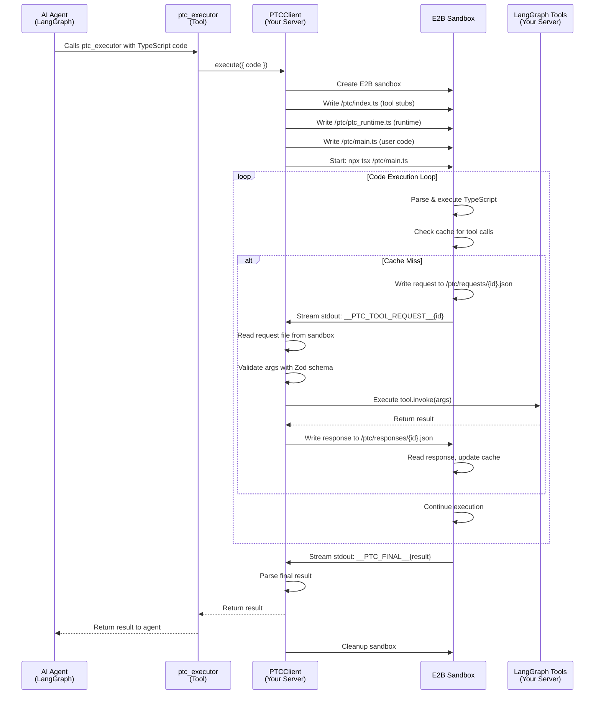

# @gdrl/ptc

**Programmatic tool calling** library for LangGraph using E2B sandboxes to execute untrusted arbitrary AI-written TypeScript, intergrating with existing LangGraph tools and createAgent() paradigm.

Resources

[](https://www.npmjs.com/package/@gdrl/ptc)
[](https://opensource.org/licenses/MIT)

> ⚠️ **Compatibility Notice**: PTC middleware is currently **not compatible** with LangGraph deep agents (`deepagents` package). Use PTC with standard `createAgent` from `langchain` instead.

## About

PTC (Programmatic Tool Calling) executes AI-written TypeScript code in an E2B sandbox, allowing your agents to programmatically call your LangGraph tools and have access to a filesystem via an E2B sandbox. All while keeping your actual tool execution on the langgraph server.

This project was inspired by [Anthropic's blog post on Advanced Tool Use](https://www.anthropic.com/engineering/advanced-tool-use). It provides a LangGraph-ready implementation using LangGraph middleware and E2B sandboxes for untrusted arbitrary code execution.

### The Problem

As AI agents scale to work with hundreds or thousands of tools, traditional tool calling creates fundamental limitations:

**Context Pollution from Intermediate Results**: When an agent analyzes a large dataset or fetches multiple records, every intermediate result enters the model's context window—even when only summaries or specific insights are needed. A 10MB log file analysis or multi-table database query can consume massive token budgets, pushing critical information out of context entirely.

**Inference Overhead and Manual Synthesis**: Each tool call requires a full model inference pass. After receiving results, the agent must manually parse data, extract relevant information, compare values, and synthesize conclusions through natural language reasoning. A workflow with five tool calls means five separate inference passes plus the cognitive overhead of processing each result. This is both slow and error-prone.

**Scalability Challenges**: As tool libraries grow, stuffing every tool definition into context upfront becomes impractical. Tool results and definitions can consume 50,000+ tokens before an agent even reads a request. Agents need the flexibility to discover and use tools on-demand, keeping only what's relevant for the current task.

> **Note**: Taken from [Anthropic's research blog on Advanced Tool Use](https://www.anthropic.com/engineering/advanced-tool-use).

### The Solution

PTC enables agents to orchestrate tools through code execution rather than individual API round-trips. Instead of calling tools one at a time with each result polluting the context window, agents write TypeScript code that:

1. **Calls multiple tools in loops and conditionals** - Process data efficiently without intermediate results entering context
2. **Transforms and filters data before returning** - Only relevant information enters the model's context window
3. **Handles complex control flow explicitly** - Loops, conditionals, error handling, and data transformations are explicit in code rather than implicit in natural language reasoning
4. **Reduces inference overhead** - Multiple tool calls happen in a single execution pass, with results processed programmatically

**Security & Control**: The code runs in an isolated E2B sandbox, while real tool execution happens on the langgraph server. **You maintain full control over tool implementations and data access while executing untrusted AI-written code in a sandbox**. This prevents AI-code from touching the LangGraph server.

**Context Efficiency**: By processing tool results in code, agents can extract only the insights they need—summaries, aggregations, filtered subsets—rather than dumping entire datasets into context. This dramatically reduces token consumption and keeps important information accessible.

## Installation

```bash
npm install @gdrl/ptc
# or
pnpm add @gdrl/ptc
```

## Quick Start

### 1. Install Dependencies

```bash
pnpm add @gdrl/ptc langchain @langchain/core @langchain/langgraph @langchain/openai
```

### 2. Create Your Tools

```typescript
// tools.ts
import { tool } from 'langchain';
import * as z from 'zod';

export const getWeather = tool(
  async ({ city }: { city: string }) => {
    // Your actual tool implementation
    return { weather: 'sunny', city };
  },
  {
    name: 'get_weather',
    description: 'Get weather for a city',
    schema: z.object({
      city: z.string().describe('City name'),
    }),
  }
);
```

### 3. Set Up Your Agent

```typescript
// agent.ts
import { createAgent } from 'langchain';
import { ChatOpenAI } from '@langchain/openai';
import { MemorySaver } from '@langchain/langgraph';
import { PTCClient, createPTCMiddleware, createExecutorTool, type PTCTool } from '@gdrl/ptc';
import * as z from 'zod';
import { getWeather } from './tools.js';

// Initialize PTC client with tools
// You can provide tools directly, or use the PTCTool interface to provide output schemas
// Input schemas are automatically read from the LangGraph tool definition
const tools: PTCTool[] = [
  {
    tool: getWeather,
    outputSchema: z.object({
      weather: z.string(),
      city: z.string(),
    }),
  },
];

const ptcClient = new PTCClient({
  e2bApiKey: process.env.E2B_API_KEY!,
  tools,
  maxRecursionLimit: 100,
  timeoutMs: 30000,
});

// Create middleware (injects tool catalog into system prompt)
const ptcMiddleware = createPTCMiddleware({ ptcClient });

// Create executor tool (the only tool your agent needs)
const ptcExecutor = createExecutorTool(ptcClient);

// Create your agent
export const agent = createAgent({
  model: new ChatOpenAI({
    modelName: 'gpt-5.2',
  }),
  tools: [ptcExecutor], // Only this one tool!
  middleware: [ptcMiddleware], // Add any other middlewares as needed
  checkpointer: new MemorySaver(),
  systemPrompt: 'You are a helpful assistant. Use ptc_executor to write TypeScript code that uses available tools.',
});
```

### 4. Use Your Agent

```typescript
// index.ts
import { agent } from './agent.js';

const result = await agent.invoke({
  messages: [{
    role: 'user',
    content: 'Get the weather for London, Paris, and Tokyo, then tell me which city has the best weather.'
  }],
});

console.log(result.messages.at(-1)?.content);
```

## Example: What the Agent Writes

When you ask the agent to "get weather for multiple cities", it might write code like:

```typescript
const cities = ['london', 'paris', 'tokyo'];
const results = [];

for (const city of cities) {
  const weather = await get_weather({ city });
  results.push({ city, weather: weather.weather });
}

const bestWeather = results.reduce((best, current) => 
  current.weather === 'sunny' ? current : best
);

return { 
  cities: results,
  recommendation: `Visit ${bestWeather.city} - it's ${bestWeather.weather}!`
};
```

This code runs in the E2B sandbox, but `get_weather` executes on your server!

## Features

- ✅ **Secure**: AI-written code runs in isolated E2B sandbox
- ✅ **Flexible**: Agent can write complex TypeScript with loops, functions, conditionals
- ✅ **Cached**: Tool results are cached to avoid redundant calls
- ✅ **Type-safe**: Full TypeScript support with Zod schema validation
- ✅ **LangGraph Ready**: Works seamlessly with LangGraph agents (via `createAgent`)
- ⚠️ **Deep Agents**: Not yet compatible with `deepagents` package (see compatibility notice above)
- ✅ **Error Handling**: Clear error messages help the agent fix mistakes

## Configuration Options

```typescript
const ptcClient = new PTCClient({
  e2bApiKey: process.env.E2B_API_KEY!,
  tools: [/* your tools */],
  
  // Optional: Maximum number of tool calls (prevents infinite loops)
  maxRecursionLimit: 100, // default: 100
  
  // Optional: Timeout for sandbox execution
  timeoutMs: 30000, // default: E2B default timeout
});
```

## Tool Output Schemas

You can optionally specify output schemas for better type safety using the `PTCTool` interface. Input schemas are automatically read from your LangGraph tool definition, but you can provide output schemas explicitly:

```typescript
import * as z from 'zod';
import type { PTCTool } from '@gdrl/ptc';

const ptcTools: PTCTool[] = [
  {
    tool: getWeather,
    outputSchema: z.object({
      weather: z.string(),
      city: z.string(),
    }),
  },
];
```

The `PTCTool` interface allows you to wrap your LangGraph tools with output schemas. If you don't provide an output schema, the return type will be `any`.

## Project Structure

```
ptc/
├── packages/
│   ├── ptc/              # Main @gdrl/ptc package
│   │   ├── src/          # Source code
│   │   ├── tests/        # Unit tests
│   │   └── dist/         # Compiled output
│   └── ptc-example/      # Example LangGraph agent
│       ├── src/
│       │   ├── agent.ts  # Agent setup
│       │   ├── tools.ts   # Example tools
│       │   └── index.ts   # Example usage
│       └── langgraph.json
├── .github/
│   └── workflows/        # CI/CD
└── README.md
```

## Development

```bash
# Install dependencies
pnpm install

# Build all packages
pnpm build

# Run tests
cd packages/ptc
pnpm test

# Run example agent
cd packages/ptc-example
pnpm dev

# Run LangGraph server
cd packages/ptc-example
pnpm langgraph
```

## Requirements

- Node.js 20+
- E2B API key ([get one here](https://e2b.dev))
- LangChain v1+ and LangGraph v1+

## Environment Variables

```bash
E2B_API_KEY=your_e2b_api_key_here
HELICONE_API_KEY=your_helicone_key_here  # Optional, for LLM proxy
```

## Technical Implementation

The following diagram shows the exact execution flow of PTC:



### Key Implementation Details

1. **ptc_executor call**: The agent calls the `ptc_executor` tool with TypeScript code
2. **Sandbox creation**: PTCClient creates an isolated E2B sandbox
3. **Code generation**: The client generates:
   - `/ptc/index.ts`: Type-safe tool stubs that agents can import
   - `/ptc/ptc_runtime.ts`: Runtime that handles tool calls via file-based communication
   - `/ptc/main.ts`: Wrapper around user code that captures the return value
4. **Execution loop**: 
   - Code runs in the sandbox using `tsx` (TypeScript executor)
   - When code calls a tool, it writes a request file and signals via stdout
   - Client monitors stdout for `__PTC_TOOL_REQUEST__` markers
   - Client reads request, validates with Zod, executes tool on LangGraph server
   - Client writes response back to sandbox
   - Sandbox reads response, updates cache, and continues execution
5. **Checkpoints**: The E2B sandbox persists throughout execution, allowing stateful operations
6. **Final result**: Code streams `__PTC_FINAL__{result}` marker, which client parses and returns
7. **Tool execution**: Only tool execution happens on the LangGraph server; code runs in isolation

The sandbox persists for the entire execution, avoiding recompilation overhead and enabling stateful operations like file I/O.

## Contributing

Contributions welcome! Please feel free to submit a Pull Request.

## License

MIT License - see [LICENSE](LICENSE) file for details.

## Links

- [npm package](https://www.npmjs.com/package/@gdrl/ptc)
- [E2B Documentation](https://docs.e2b.dev)
- [LangGraph Documentation](https://langchain-ai.github.io/langgraph/)
